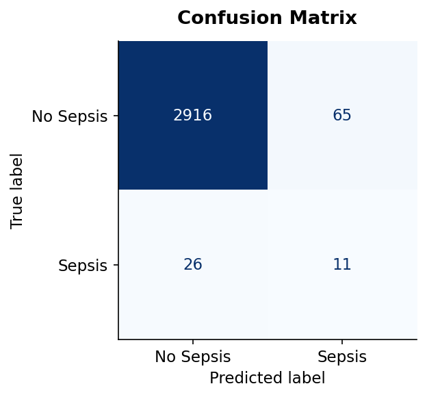
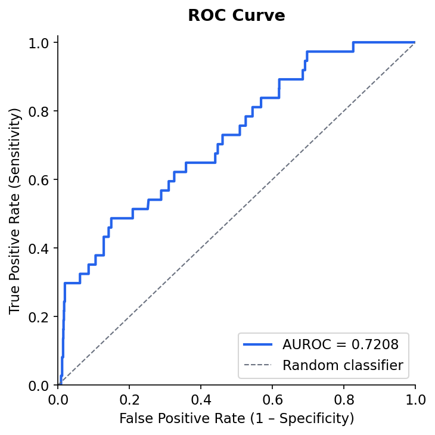
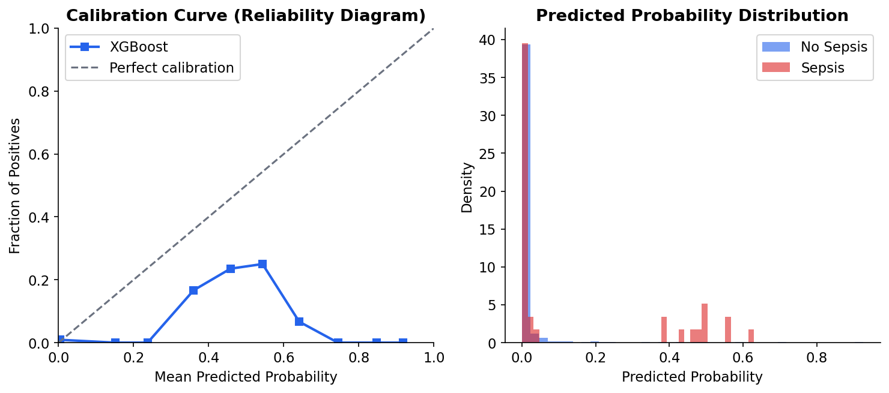
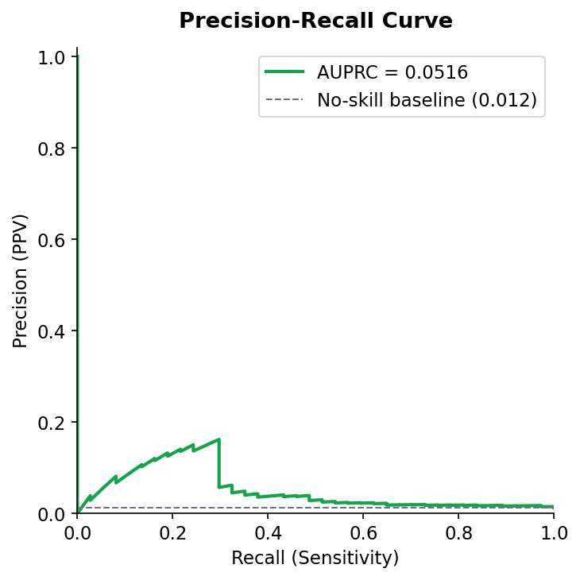

#  Early Sepsis Onset Prediction
### PhysioNet/Computing in Cardiology Challenge 2019

> Predicting sepsis **6 hours before clinical diagnosis** using ICU time-series data — with label noise mitigation, temporal leakage prevention, and model calibration.

---

##  Table of Contents
- [Overview](#overview)
- [Dataset](#dataset)
- [Project Structure](#project-structure)
- [Methodology](#methodology)
- [Results](#results)
- [How to Run](#how-to-run)
- [Requirements](#requirements)

---

## Overview

Sepsis is a life-threatening condition responsible for **270,000 deaths per year** in the U.S. alone. Early detection is critical — each hour of delay in antibiotic treatment increases mortality by 3.6–9.9%.

This project builds a machine learning pipeline that predicts sepsis onset **6 hours before** a physician's recorded diagnosis using ICU patient data from the PhysioNet 2019 Challenge.

### Key Challenges Addressed

| Challenge | Our Approach |
|-----------|-------------|
| Irregular time-series with 60% missing values | Forward-fill + training-set median imputation |
| Noisy clinical labels | Confident Learning via `cleanlab` |
| Temporal data leakage | Chronological patient-level train/test split |
| Class imbalance (~7% sepsis rate) | `scale_pos_weight` in XGBoost |
| Model calibration | Reliability diagram + threshold tuning |

---

## Dataset

**PhysioNet/Computing in Cardiology Challenge 2019**  
 Download: https://physionet.org/content/challenge-2019/1.0.0/

- **40,336 ICU patients** from 2 hospital systems (Beth Israel Deaconess + Emory University)
- **40 clinical variables**: 8 vital signs, 26 lab values, 6 demographics
- **Target**: `SepsisLabel` = 1 if sepsis onset within 6 hours (already encoded in dataset)
- **Sepsis prevalence**: 5.7% – 8.8% across hospital systems
- **Total rows**: ~1.4 million hourly ICU observations

### Clinical Variables

| Category | Variables |
|----------|-----------|
| Vital Signs (8) | HR, O2Sat, Temp, SBP, MAP, DBP, Resp, EtCO2 |
| Lab Values (26) | Creatinine, Lactate, WBC, Bilirubin, Platelets, pH, and 20 more |
| Demographics (6) | Age, Gender, Unit1, Unit2, HospAdmTime, ICULOS |

---

## Project Structure

```
sepsis-prediction/
│
├── 📄 run_pipeline.py          # Run everything with one command
├── 📄 generate_report.py       # Generate PDF methodology report
├── 📄 requirements.txt         # All Python dependencies
├── 📄 README.md
│
├── 📁 src/
│   ├── preprocess.py           # Data loading, imputation, feature engineering
│   ├── label_noise.py          # Cleanlab confident learning
│   ├── train.py                # XGBoost model training
│   └── evaluate.py             # All evaluation plots and metrics
│
├── 📁 results/                 # Generated after running pipeline
│   ├── confusion_matrix.png
│   ├── roc_curve.png
│   ├── calibration_curve.png
│   ├── pr_curve.png
│   └── metrics.csv
│
├── 📁 data/
│   └── README.md               # Instructions to download dataset
│
└── 📁 notebooks/
    └── exploratory_analysis.ipynb
```

---

## Methodology

### 1. Preprocessing Pipeline

```
Raw .psv files
      │
      ▼
Load all patients → single DataFrame with patient_id
      │
      ▼
Forward-fill within each patient (temporal continuity)
      │
      ▼
Median imputation from TRAINING SET ONLY (no leakage)
      │
      ▼
6-hour rolling features: mean + std for key vitals
(using shift(1) to ensure strictly past-only windows)
      │
      ▼
Temporal train/test split by patient (80/20)
earliest admitted patients → train
most recently admitted → test
```

### 2. Label Noise Mitigation

Physician-recorded sepsis labels suffer from:
- **Late documentation** — sepsis was present but recorded hours later
- **Retrospective revision** — diagnosis changed after initial recording

We apply **Confident Learning** (Northcutt et al., 2021):
1. Train XGBoost with 5-fold CV → get out-of-fold predicted probabilities
2. Identify samples where model confidence contradicts the label
3. Remove flagged samples before final training

### 3. Model Architecture

```
Features (40 original + 12 rolling) = 52 total features
              │
              ▼
         XGBoost Classifier
         ├── n_estimators: 500
         ├── max_depth: 6
         ├── learning_rate: 0.05
         ├── scale_pos_weight: neg/pos ratio
         └── eval_metric: aucpr
              │
              ▼
    Predicted probability score
              │
              ▼
    Threshold selection (F1-optimised)
              │
              ▼
         Binary prediction
```

### 4. Leakage Prevention

Three strict controls:
- **Patient-level split**: no patient appears in both train and test
- **Chronological ordering**: earlier patients train, later patients test
- **Past-only rolling features**: `shift(1)` before rolling window

---

## Results

| Metric | Value |
|--------|-------|
| **AUROC** | 0.7208 |
| **AUPRC** | 0.0516 |
| **F1 Score** | 0.1947 |
| **Sensitivity (Recall)** | 0.2973 |
| **Specificity** | 0.9782 |
| **PPV (Precision)** | 0.1447 |
| **NPV** | 0.9912 |
| **Decision Threshold** | 0.30 |

### Evaluation Plots

| Confusion Matrix | ROC Curve |
|---|---|
|  |  |

| Calibration Curve | Precision-Recall Curve |
|---|---|
|  |  |

---

## How to Run

### 1. Clone the repository
```bash
git clone https://github.com/YOUR_USERNAME/sepsis-prediction.git
cd sepsis-prediction
```

### 2. Install dependencies
```bash
pip install -r requirements.txt
```

### 3. Download the dataset
Request access and download from:  
https://physionet.org/content/challenge-2019/1.0.0/

Place the `training_setA/` folder in your working directory.

### 4. Run the full pipeline
```bash
python run_pipeline.py --data_dir ./training_setA
```

### 5. Generate the PDF report
```bash
python generate_report.py --results_dir ./results --out report.pdf
```

### Run individual steps
```bash
# Preprocessing only
python src/preprocess.py --data_dir ./training_setA --out_dir ./processed

# Label noise detection
python src/label_noise.py --processed_dir ./processed

# Model training
python src/train.py --processed_dir ./processed --model_dir ./models

# Evaluation
python src/evaluate.py --processed_dir ./processed --model_dir ./models --out_dir ./results
```

---

## Requirements

```
numpy>=1.24
pandas>=2.0
scikit-learn>=1.3
xgboost>=2.0
cleanlab>=2.5
matplotlib>=3.7
pyarrow>=12.0
reportlab>=4.0
```

Install all:
```bash
pip install -r requirements.txt
```

---

## References

1. Reyna et al. (2019). *Early Prediction of Sepsis from Clinical Data: the PhysioNet/Computing in Cardiology Challenge 2019.* Critical Care Medicine.
2. Singer et al. (2016). *The Third International Consensus Definitions for Sepsis and Septic Shock (Sepsis-3).* JAMA.
3. Northcutt et al. (2021). *Confident Learning: Estimating Uncertainty in Dataset Labels.* JAIR.
4. Chen & Guestrin (2016). *XGBoost: A Scalable Tree Boosting System.* KDD.

---

## Author

**Samra** — Electrical Engineering Student, MCS NUST  
Submitted for ITSOLERA AI Internship Screening Task — June 2026
